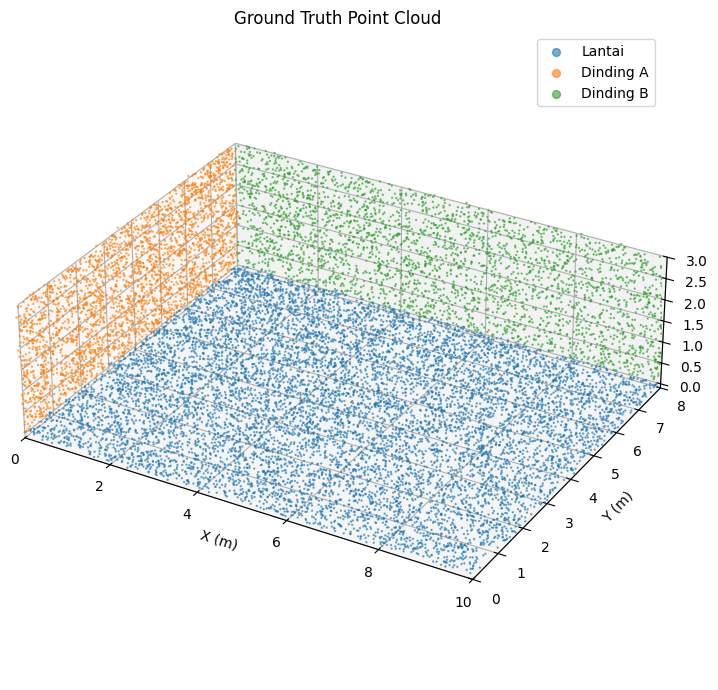
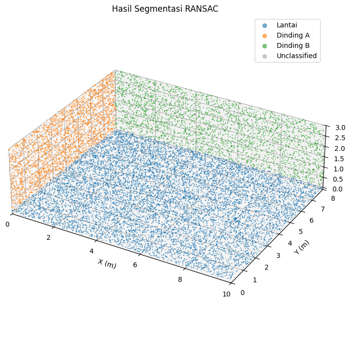
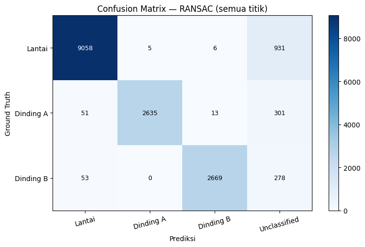
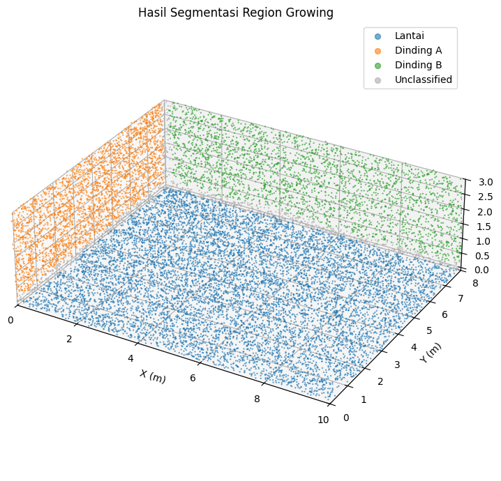
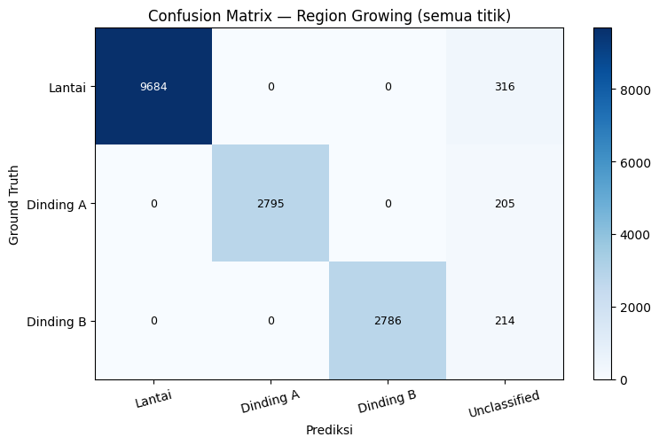
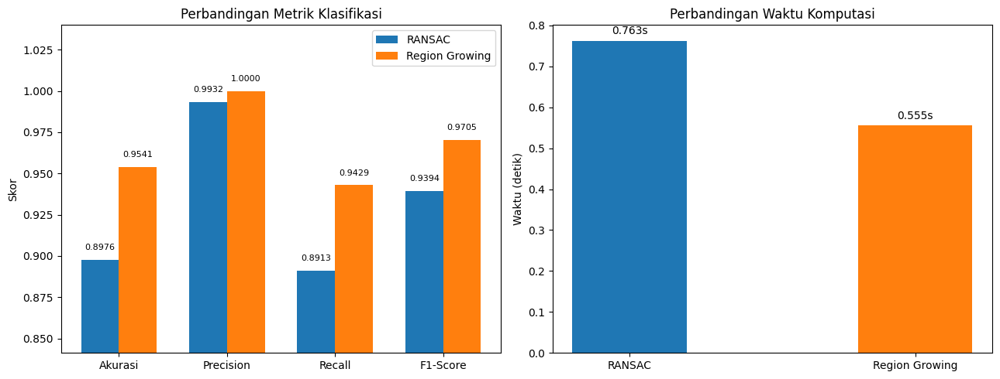

# Laporan: Point Cloud Processing
## Segmentasi Bidang dari Data LiDAR Sintetis

**Mata Kuliah:** Sensor dan Sistem Pemrosesan Sinyal  
**Nama:** M Alfiyan Syamsuddin  
**NRP:** 1225800008  

---

## 1. Pendahuluan

Point cloud adalah representasi spasial dari sekumpulan titik dalam ruang tiga dimensi, biasanya dihasilkan oleh sensor LiDAR atau depth camera. Setiap titik membawa informasi koordinat (x, y, z), dan secara kolektif membentuk model geometri permukaan suatu objek atau lingkungan.

Tantangan utama dalam pemrosesan point cloud bukan sekadar menyimpan atau menampilkan titik-titik tersebut, melainkan memahami struktur geometri yang terkandung di dalamnya. Salah satu tugas paling mendasar adalah mengidentifikasi bidang-bidang yang membentuk lingkungan (lantai, dinding, plafon), yang dikenal sebagai **segmentasi bidang** (*plane segmentation*).

Praktikum ini mengeksplorasi dua pendekatan berbeda untuk segmentasi bidang:

1. **RANSAC iteratif**, pendekatan berbasis konsensus statistik yang bekerja top-down: cari model bidang terbaik dari sampel acak, verifikasi dengan semua data.
2. **Region Growing**, pendekatan berbasis propagasi lokal yang bekerja bottom-up: mulai dari satu titik, tumbuhkan wilayah selama karakteristik permukaan (normal vektor) konsisten.

Kedua metode ini mewakili dua pola pemikiran berbeda dalam pemrosesan sinyal geometris: satu mengandalkan robustness statistik, satu mengandalkan konsistensi lokal. Menarik untuk melihat mana yang lebih efisien untuk kasus spesifik ini.

---

## 2. Dataset: Generasi Point Cloud Sintetis

### 2.1 Desain Data

Data dibangkitkan secara sintetis untuk merepresentasikan sudut ruangan dengan tiga permukaan planar:

| Komponen | Bidang | Label | Jumlah Titik |
|---|---|---|---|
| Lantai | z = 0 (horizontal) | 0 | 10.000 |
| Dinding A | x = 0 (vertikal) | 1 | 3.000 |
| Dinding B | y = W (vertikal, ⊥ Dinding A) | 2 | 3.000 |

**Parameter ruangan:** Panjang L = 10 m, Lebar W = 8 m, Tinggi H = 3 m.  
**Total titik:** 16.000.

### 2.2 Model Generasi

Setiap permukaan dibangkitkan dengan distribusi berbeda sesuai orientasinya:

**Lantai (z = 0):**
$$x_i \sim U(0, L), \quad y_i \sim U(0, W), \quad z_i \sim \mathcal{N}(0,\ 0.03^2)$$

Noise Gaussian pada sumbu-z merepresentasikan ketidakrataan permukaan nyata. Lantai tidak pernah benar-benar flat sempurna pada level milimeter.

**Dinding A (x = 0):**
$$x_i \sim \mathcal{N}(0,\ 0.03^2), \quad y_i \sim U(0, W), \quad z_i \sim U(0, H)$$

**Dinding B (y = W):**
$$y_i \sim \mathcal{N}(W,\ 0.03^2), \quad x_i \sim U(0, L), \quad z_i \sim U(0, H)$$

Noise σ = 0.03 m (3 cm) dipilih untuk mensimulasikan LiDAR dengan presisi tinggi namun tetap realistis. Tidak ada sensor yang menghasilkan titik-titik pada bidang sempurna.

**Catatan desain:** Dinding B diletakkan di y = W (bukan y = 0) agar kedua dinding tidak overlap di area origin. Ini penting untuk menguji kemampuan kedua metode memisahkan bidang yang tidak saling bersinggungan.

### 2.3 Verifikasi Statistik

Untuk memastikan data yang dibangkitkan sesuai dengan model matematis, statistik aktual dihitung dan dibandingkan dengan parameter distribusi teoritis:

**Lantai — sumbu noise z ~ N(0, 0.03²):**

| Parameter | Model | Aktual | Deviasi |
|---|---|---|---|
| μ(z) | 0.000 | 0.00010 | < 0.01% |
| σ(z) | 0.030 | 0.02968 | 1.07% |

**Dinding A — sumbu noise x ~ N(0, 0.03²):**

| Parameter | Model | Aktual | Deviasi |
|---|---|---|---|
| μ(x) | 0.000 | −0.00025 | < 0.01% |
| σ(x) | 0.030 | 0.03021 | 0.70% |

**Dinding B — sumbu noise y ~ N(W, 0.03²):**

| Parameter | Model | Aktual | Deviasi |
|---|---|---|---|
| μ(y) | 8.000 | 7.99953 | < 0.01% |
| σ(y) | 0.030 | 0.02920 | 2.67% |

Seluruh sumbu noise menunjukkan deviasi < 3% dari parameter distribusi teoritis, konsisten dengan hukum bilangan besar pada N = 3.000–10.000 sampel. Sumbu seragam (Uniform) memiliki mean aktual ≈ midpoint interval dan range hampir mencapai batas teoritisnya.

### 2.4 Reproducibility

`np.random.seed(42)` diset di awal eksekusi. Ini memastikan setiap run menghasilkan data identik, bukan sekadar konvensi, tapi kebutuhan untuk eksperimen yang dapat direplikasi dan dibandingkan secara fair.

### 2.5 Visualisasi Ground Truth



*Gambar 1. Point cloud sintetis dengan label ground truth: lantai (biru), Dinding A (oranye), Dinding B (hijau).*

---

## 3. Metode 1: RANSAC Iteratif

### 3.1 Konsep

RANSAC (*Random Sample Consensus*) adalah algoritma estimasi model yang robust terhadap outlier (Fischler & Bolles, 1981). Model bidang yang digunakan:

$$ax + by + cz + d = 0, \quad \text{dengan } a^2 + b^2 + c^2 = 1$$

Proses per iterasi:
1. Pilih 3 titik secara acak → hitung normal bidang via cross product
2. Hitung jarak semua titik ke bidang: $\text{dist}_i = |a x_i + b y_i + c z_i + d|$
3. Titik dengan dist < threshold dianggap **inlier**
4. Simpan model dengan inlier terbanyak

Setelah N iterasi, model terbaik dipilih. Pada praktikum ini N = 1000 dan threshold = 0.05 m.

### 3.2 Implementasi Iteratif

Karena ada tiga bidang yang perlu ditemukan, RANSAC dijalankan tiga kali secara berurutan:

```
Iterasi 1: Cari bidang dengan inlier terbanyak dari semua 16.000 titik
           → Label titik sebagai inlier bidang tersebut
           → Hapus inlier dari pool
Iterasi 2: Jalankan RANSAC pada titik yang tersisa
Iterasi 3: Jalankan RANSAC pada titik yang tersisa lagi
```

Pendekatan ini efektif karena bidang yang paling besar (lantai, 10.000 titik) akan selalu ditemukan pertama; secara statistik, frekuensi random sampling akan lebih banyak memilih inlier dari bidang dengan populasi titik terbesar.

### 3.3 Penentuan Label

Setelah normal bidang `(a, b, c)` ditemukan, label ditentukan dari komponen dominan:

```python
dominant = argmax(|a|, |b|, |c|)
label = {0: 1, 1: 2, 2: 0}[dominant]
# dominant-x → Dinding A (label 1)
# dominant-y → Dinding B (label 2)
# dominant-z → Lantai    (label 0)
```

Ini bekerja karena ketiga bidang saling tegak lurus, sehingga normalnya masing-masing sejajar dengan salah satu sumbu koordinat.

### 3.4 Hasil



*Gambar 2. Hasil segmentasi RANSAC: lantai (biru), Dinding A (oranye), Dinding B (hijau), titik unclassified (abu-abu).*



*Gambar 3. Confusion matrix hasil segmentasi RANSAC (dihitung pada titik yang terklasifikasi).*

| Metrik | Nilai |
|---|---|
| Waktu komputasi | 0.771 detik |
| Titik terklasifikasi | 14.490 / 16.000 (90.6%) |
| Unclassified | 1.510 (9.4%) |
| Akurasi | 89.76% |
| Precision (macro) | 99.32% |
| Recall (macro) | 89.13% |
| F1-Score (macro) | 93.94% |

Metrik dihitung atas semua 16.000 titik; titik unclassified dihitung sebagai prediksi salah (false negative untuk kelas asalnya). Precision tinggi (99.32%) menunjukkan hampir tidak ada salah label antar kelas — kesalahan RANSAC murni berupa titik yang tidak diklaim oleh inlier manapun, terutama di area transisi antar bidang.

---

## 4. Metode 2: Region Growing

### 4.1 Konsep

Region Growing mendekati masalah dari perspektif yang berbeda: alih-alih mencari model global yang fit ke sebanyak mungkin titik, ia mempropagasi region secara lokal berdasarkan kesamaan karakteristik permukaan (Adams & Bischof, 1994).

Intuisinya sederhana: dua titik tetangga yang berada di bidang yang sama akan memiliki **normal vektor yang hampir sejajar**. Ini menjadi kriteria pertumbuhan.

Algoritma:
1. Estimasi normal permukaan setiap titik menggunakan PCA pada K tetangga terdekat
2. Iterasi semua titik yang belum dikunjungi sebagai seed
3. BFS dari seed: tambahkan tetangga ke region jika sudut antara normalnya dan normal referensi < threshold
4. Region yang cukup besar (≥ min_pts) disimpan
5. Ambil 3 region terbesar → tentukan label dari normal rata-rata region

### 4.2 Estimasi Normal

Normal dihitung menggunakan Open3D (Zhou et al., 2018) dengan pendekatan PCA:

```python
pcd.estimate_normals(
    search_param=KDTreeSearchParamHybrid(radius=0.5, max_nn=30)
)
```

Untuk setiap titik, Open3D mencari tetangga dalam radius 0.5 m (maks 30 titik), lalu melakukan PCA pada koordinat tetangga tersebut. Eigenvector dengan eigenvalue terkecil menjadi estimasi normal permukaan.

### 4.3 Kriteria Pertumbuhan

Kondisi untuk menambahkan tetangga ke region:

$$\cos(\theta) = |\hat{n}_{nb} \cdot \hat{n}_{ref}| \geq \cos(15°) \approx 0.966$$

Nilai absolut digunakan karena Open3D tidak menjamin konsistensi orientasi normal (bisa menunjuk ke dalam atau ke luar). Yang penting adalah **arah bidang**, bukan orientasinya.

Threshold 15° dipilih: cukup besar untuk mentoleransi noise estimasi normal, cukup kecil untuk tidak mencampur bidang yang berbeda (lantai dan dinding memiliki perbedaan 90°).

### 4.4 Hasil



*Gambar 4. Hasil segmentasi Region Growing: lantai (biru), Dinding A (oranye), Dinding B (hijau), titik unclassified (abu-abu).*



*Gambar 5. Confusion matrix hasil segmentasi Region Growing.*

| Metrik | Nilai |
|---|---|
| Waktu komputasi | 0.526 detik |
| Region ditemukan | 3 |
| Titik terklasifikasi | 15.265 / 16.000 (95.4%) |
| Unclassified | 735 (4.6%) |
| Akurasi | 95.41% |
| Precision (macro) | 100% |
| Recall (macro) | 94.29% |
| F1-Score (macro) | 97.05% |

Region Growing menemukan tepat 3 region, sesuai dengan 3 bidang yang ada. Tidak ada region spurious, tidak ada bidang yang terpecah. Precision 100% berarti tidak ada satu pun titik yang salah label antar kelas — satu-satunya "kesalahan" adalah 735 titik yang tidak terjangkau BFS dari seed manapun.

---

## 5. Perbandingan dan Analisis

### 5.1 Visualisasi Perbandingan



*Gambar 6. Perbandingan metrik klasifikasi (kiri) dan waktu komputasi (kanan) antara RANSAC dan Region Growing.*

### 5.2 Tabel Perbandingan

| Dimensi | RANSAC | Region Growing |
|---|---|---|
| **Akurasi** | 89.76% | **95.41%** |
| **Precision** | 99.32% | **100%** |
| **Recall** | 89.13% | **94.29%** |
| **F1-Score** | 93.94% | **97.05%** |
| **Waktu** | 0.771 det | **0.526 det** |
| **Unclassified** | 1.510 titik | **735 titik** |
| **Coverage** | 90.6% | **95.4%** |

### 5.3 Mengapa Region Growing Unggul di Kasus Ini?

Perbedaan performa ini bukan kebetulan, melainkan konsekuensi langsung dari karakteristik data.

**Data ini memiliki struktur yang sangat "bersih":**
- Tiga bidang saling tegak lurus → normal berbeda 90° satu sama lain
- Noise σ = 0.03 m sangat kecil → normal estimasi akurat
- Tidak ada outlier ekstrim → tidak ada "noise point" yang jauh dari bidang manapun

Dalam kondisi ini, Region Growing memiliki keunggulan struktural: ia **mengeksploitasi konsistensi lokal** yang memang sangat kuat pada data ini. Setiap titik di lantai dikelilingi tetangga yang semuanya juga di lantai, dengan normal hampir identik. Propagasi BFS berjalan sempurna.

RANSAC, di sisi lain, bergantung pada sampling acak. Ada probabilitas kecil bahwa 3 titik terpilih menghasilkan model suboptimal yang tidak mewakili bidang utama. Dengan 1000 iterasi, probabilitas ini sangat kecil, tapi tidak nol. Itulah sumber dari 1.510 titik unclassified: boundary titik yang tidak masuk ke inlier set manapun.

### 5.4 Konteks: Kapan RANSAC Lebih Relevan?

Meskipun Region Growing unggul di sini, RANSAC memiliki kelebihan pada skenario berbeda:

- **Data dengan outlier berat** (LiDAR di luar ruangan, pantulan, vegetasi) → RANSAC lebih robust karena by design mengabaikan outlier.
- **Bidang yang terputus-putus** (tidak continuous) → RANSAC bisa menemukan satu bidang dari fragmen yang terpisah.
- **Data tanpa normal yang bisa dipercaya** → Region Growing breakdown jika estimasi normal tidak akurat (sparse point cloud, occlusion berat).

Sebaliknya, Region Growing lebih cocok untuk:
- Data dense, low-noise seperti indoor LiDAR
- Kasus di mana bidang saling berdekatan dan berbagi boundary
- Situasi di mana coverage tinggi lebih penting daripada precision absolut

### 5.5 Kompleksitas Komputasi

| | RANSAC | Region Growing |
|---|---|---|
| **Time complexity** | O(N · K) per iterasi, K iterasi | O(N · k) untuk BFS + O(N · k) normal estimasi |
| **Bottleneck** | Sampling + distance computation | Normal estimation + KD-tree search |
| **Skala ke N besar** | Linear per iterasi, jumlah iterasi tetap | Linear, tapi BFS dengan Python loop bisa lambat |

Untuk N = 16.000, Region Growing lebih cepat karena estimasi normal Open3D menggunakan implementasi C++ yang dioptimasi, sedangkan RANSAC pure Python (1000 × N distance computation).

---

## 6. Kesimpulan

Dua pola pikir berbeda, dua hasil berbeda, satu insight yang sama: **pilihan algoritma harus mengikuti struktur data, bukan sebaliknya**.

**Temuan utama:**

1. Region Growing outperform RANSAC pada semua metrik untuk dataset ini: akurasi 95.41% vs 89.76%, F1-Score 97.05% vs 93.94%, coverage lebih tinggi (95.4% vs 90.6%), dan waktu lebih cepat (0.526 vs 0.771 detik). Ini bukan karena Region Growing "lebih baik" secara universal, tapi karena karakteristik data (bidang saling tegak lurus, noise kecil, dense) sangat cocok dengan asumsi algoritma tersebut.

2. RANSAC tetap menghasilkan performa yang baik (F1 = 93.94%) dan jauh lebih general, sehingga lebih cocok untuk data real-world dengan outlier, sparse coverage, atau bidang yang tidak continuous.

3. Evaluasi menggunakan semua 16.000 titik; titik unclassified dihitung sebagai false negative, sehingga recall dan akurasi mencerminkan kemampuan coverage algoritma secara keseluruhan, bukan hanya kebenaran label pada titik yang berhasil diklasifikasikan.

**Pertanyaan terbuka untuk eksplorasi lanjut:** Bagaimana performa kedua metode pada data yang lebih realistis, misalnya point cloud dari LiDAR outdoor dengan vegetasi, kendaraan, dan surface yang non-planar? Di sana, kemungkinan besar gambarnya akan terbalik.

---

## 7. Referensi

- Fischler, M. A., & Bolles, R. C. (1981). Random sample consensus: a paradigm for model fitting with applications to image analysis and automated cartography. *Communications of the ACM*, 24(6), 381–395.
- Adams, R., & Bischof, L. (1994). Seeded region growing. *IEEE Transactions on Pattern Analysis and Machine Intelligence*, 16(6), 641–647.
- Zhou, Q.-Y., Park, J., & Koltun, V. (2018). Open3D: A modern library for 3D data processing. *arXiv:1801.09847*.

**Source code:** Repository lengkap tersedia di [github.com/alfiyansys/VI202205-Point-Cloud-Processing](https://github.com/alfiyansys/VI202205-Point-Cloud-Processing). Data dibangkitkan dengan seed deterministik (42) untuk full reproducibility.
